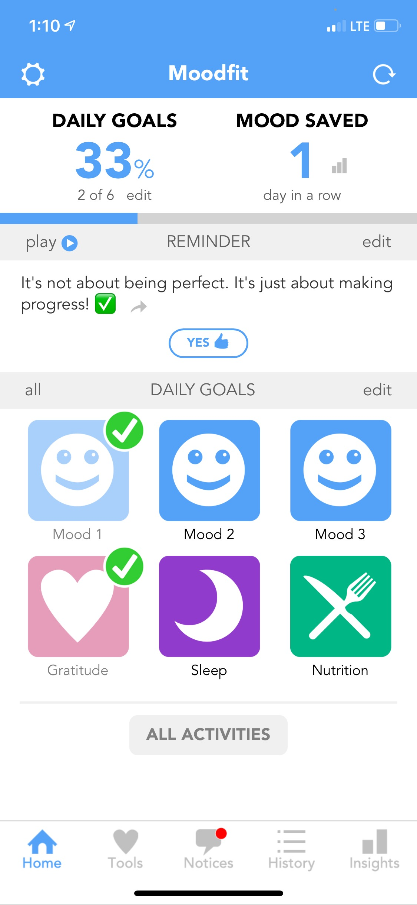
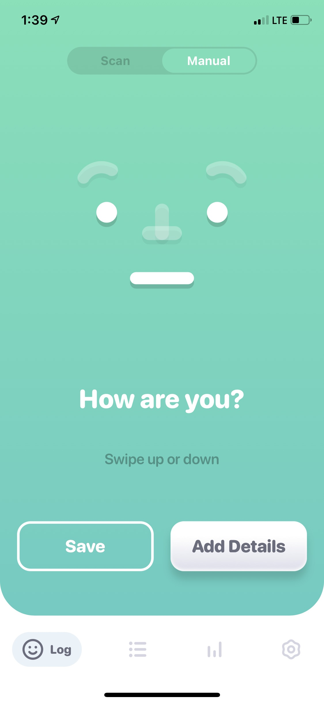

# Mental Maintenance: Helping Happiness in Middle-Aged Women

## Assignment 1: Heuristic Evaluation
Elena Leon Guerrero - DH 150 Fall 2020

Project Description:

After being tasked with a project that aimed to improve the well-being, or happiness, of the middle-aged women, I contemplated what exactly improves one's well-being. As a Psychology major, my first thought was anything and everything to do with mental health, and as someone living through a pandemic, I've realized how important it is to check in with one's emotions and thoughts throughout the days. Luckily, this mental maintenance of acknowledging and interacting with one's thoughts and emotions is actually a way to improve well-being, especially when facilitated by acts such as journaling. Journaling allows people to manage stress and anxiety, provide an outlet to evaluate and release feelings, and even track moods or symptoms on a day-to-day basis such that patterns can be learned and (hopefully) controlled. After searching the app store to find apps with features such as mood tracking and journaling, I often felt a bit overwhelmed in what exactly I would use to manage my emotions as many of them supplied a lot of other features aimed at other ways to improve my mental health that I didn't necessarily want (e.g. meditation recordings). Not only that, but some of the apps were either dated, buggy, or not-user friendly. As a result, I intend to focus my project on user-friendly app that would streamline the processes of mood tracking and journaling to allow users to manage their emotions without having to feel overwhelmed about the process. 

### Usability Issue Severity Ratings
The scale below is used to rate the severity of usability problems found in the interfaces being evaluated:
| Rating  | Significance                                                                       |
| ------- | ---------------------------------------------------------------------------------- |
| 1       | Cosmetic problem only: need not be fixed unless extra time is available on project |
| 2       | Minor usability problem: fixing this should be given low priority                  |
| 3       | Major usability problem: important to fix, so should be given high priority        |

Credit: NNGroup - https://www.nngroup.com/articles/how-to-rate-the-severity-of-usability-problems/

## App #1: Moodfit
#### Link: https://apps.apple.com/us/app/moodfit/id1054458809?mt=8

### App Description:

Moodfit is an app that aims to allow users to improve their mood by tracking their emotions on a day-to-day basis, recording journal entries of how they’re feeling, participating in mindfulness and meditation, and more. By seeing the patterns of their emotional state and practicing mental health interventions, Moodfit users will have ways to deal with mental health issues like stress, depression, and anxiety.

### Motivation for Choosing the App:

I chose this app because as I was searching for apps related to my project’s main interest, I found this one was touted as the Best Overall Mental Health App of 2020 by Verywell Mind, so I wanted to see why it gained such accolades. Moreover, it seemed very simple in its concept, so I wanted to see if this app facilitated the core actions I was aiming for in a non-overwhelming way. Upon first opening it, I saw that it did what I aimed to do with my project, but I immediately felt there were some usability issues that could be rectified in my iteration. Thus, I wanted to use this app as a basis for what I would aim to include and change after running it through a detailed heuristic evaluation.

### Overall Evaluation:

Overall, I feel like this app does provide some very good resources to its users, and I was able to get a look into how to carry out what features I intend to with my project. However, while the thought is there, the execution definitely is not. The app itself feels rather dated and buggy, and sometimes can be frustrating and not aesthetically pleasing to view as a result.
#add heuristic evaluations after overall here

### #1: Visibility of System Status

1. When a performed action is loading, a multicolored, dotted circle indicator appears. While it is nice to receive feedback that the system is working on the action, the indicator itself is both dated, less clear in terms of progress as other circle indicators are, and just feels buggy. **(2)**
    * *Recommendation: Update the circle indicator, specifically to one that smoothly fills as the performance of an action progressively reaches completion.*

2. While the circle indicator is there, there seems to be a bug such that it makes the user think that an action is still being performed when actions can actually be executed; the circle indicator was just remaining on the screen. **(3)**
    * *Recommendation: Fix the bug that prevents the circle indicator from leaving the screen when an action is completed.*

3. When “Daily Goals” are completed they are checked off on the homescreen, providing the user a great way to see what goals have been achieved for the day. However, sometimes these goals are not updated despite doing the task, which may cause a user to have to redo a goal they already have completed. **(3)**
    * *Recommendation: Fix the bug that prevents a daily goal from having a completion indicator. Additionally, a feature where a user can see logs of their completed daily goals/entries would help this issue.*

### #2: Match Between System and the Real World

1. For 2 out of the 5 tabs found at the bottom of the app, the icons and their titles either do not match up with each other, or what a user would find common across apps. For example, had I not read what the “Tools” tab was, I would not guess that was where I would find the resources for journaling or other mental health strategies by the heart icon. The same issue can be said with the history app, as I wouldn’t necessarily think that that was where I could see my mood history with an icon that looks like a checklist. **(2)**
    * *Recommendation: Change the “Tools” icon to something other than a heart (e.g. a toolkit, a brain) or rename to something more indicative with a heart icon like “Resources”. Similarly, change the icon to the “History” tab to one that depicts change over time, such as a miniature line graph.*

### #3: User Control and Freedom

1. There is a bug such that I got stuck in multiple pages (e.g. “Settings”, trying to input a mood report) because the back button completely disappeared. **(3)**
    * *Recommendation: Fix the bug that causes the back button to disappear on a user when trying to exit a function.*

2. When journaling about gratitude, when a new item slot is added, there is no button to remove the slot without having to exit the entire gratitude journaling function. **(3)**
    * *Recommendation: Add an undo or “x” button to allow users to edit the content of their gratitude lists.*

3. There is no way to view past entries regarding mood, gratitude, etc. and thus, no way to edit or revisit them, much less delete them. Without this function, users are forced to redo the entire entry if they felt something was in error, or cannot delete entries they do not want anymore. **(3)**
    * *Recommendation: Provide users with the ability to view their past entries to make changes, view, or delete entirely.*

### #4: Consistency and Standards

1. There seems to be a lack of consistency across the screens for the mental resources this app facilitates in terms of color scheme (e.g. each resource seems to have been intended its own color, yet two are exactly the same). Moreover, when utilizing a resource the header and any icons on the screen turn to the color allocated to the resource, yet for some, this pattern is not seen (e.g. the “Express Yourself” header does not turn Yellow). **(1)**
    * *Recommendation: Ensure that each resource follows the same design patterns across the app and when in use.*

2. External consistency is not maintained across other apps of this nature (See: icon/label discussion of Heuristic #2). **(2)**

### #5: Error Prevention

1. This heuristic seems to be met quite well. In cases where information is typed out, such as when inputting a mood journal, the app will notify the user of unsaved changes when they try to exit. Additionally, the app checks to make sure the user wants to sign out before doing so. However, a quick undo button is not provided during text input, which may be cumbersome when trying to edit an entry. **(1)**
    * *Recommendation: Provide an undo button when inputting text so users can quickly make changes.*

1. When filling out something like the gratitude journal, the app fails to notify the user that there is missing content if there are extra slots. **(1)**
   * *Recommendation: Check with users to make sure all the content they want to include is there if fields are left blank.*

### #6: Recognition Rather Than Recall

1. Similar to Heuristic #2 there are a lot of issues with the icons used to represent the mental tools of the app. As a user, I have personally not seen some of these icons (e.g. for “Grounding”), or they seem so vague that I’d have trouble discerning what action they’d represent. **(1)**
    * *Recommendation: Update the icons used to represent the mental tools to be more representative of their associated tasks.*

### #7: Flexibility and Efficiency of Use

1. The app meets this heuristic well. When text entries are being created, the app actually provides the user with common phrases or words to help them log the comments of their emotional state into the journal much faster. Not only that, but the user can manually input specific terms or phrases to personalize their shortcut list.
    * *Recommendation: None*

### #8: Aesthetic and Minimalistic Design

1. The design is decently minimalistic, and does a great job at keeping any descriptions of features short and to the point. However, the interface and many of the colors/icons in the app are very dated or seem out of place, and far behind the aesthetics of a lot of apps nowadays. Additionally, the quality of the icons on the navigation bar at the bottom needs to be increased. **(3)**
    * *Recommendation: Keep the minimalistic qualities of the interface the same, but overhaul the aesthetics to match the more polished look of popular apps. Update icons for image quality, as well as cohesiveness in art style.*

### #9: Help Users Recognize, Diagnose, and Recover from Errors

1. While solutions are provided when an error occurs, and they are in layman’s terms, the wording used makes it seem like it’s the user’s fault (e.g. explicitly stating “you’re”). **(3)**
    * *Recommendation: Rephrase certain error messages such that they are not placing blame on the user.*

### #10: Help and Documentation

1. There is a help and documentation page, but it requires opening the FAQ in a web browser. I feel as though it would be useful for a user to be able to access the answers to their questions directly in the app, rather than having to go to an outside source. Additionally, I think that having a search bar to find a question would streamline the help process rather than having to read a whole FAQ that doesn’t have any kind of filter. **(2)**
    * *Recommendation: Add the FAQ directly to the app, and implement a search bar function to search questions.*

### Severity Rating Overview:
1.) Cosmetic Problems: Error Prevention

2.) Minor Usability Problems: Match Between System and the Real World, Consistency and Standards, Recognition Rather Than Recall, Help and Documentation

3.) Major Usability Problems: Visibility of System Status, User Control and Freedom, Aesthetic and Minimalist Design, Help User Recognize, Diagnose and Recover from Errors

## App #2: Moodnotes
#### Link: https://apps.apple.com/us/app/moodnotes-mood-tracker/id1019230398

### App Description:

Moodnotes is a mood tracker and journaling app that helps users keep up with the patterns of their mood and thinking habits. The app lets the user log their mood in various ways, such as manual input or facial scanning, and aims to bring awareness to a user's thinking "traps", reduce their anxiety, and increase their well-being.
#add homepage pic 

### Motivation for Choosing the App:

I chose this app because, like Moodfit, this app also featured the two key criteria I was looking for: simplicity in mood tracking/journaling, and my interest in their accolades. Not only that, but I was intrigued the overall look of the app upon first glance, and thought it was a nice way to get inspired about how I would aim to design my app aesthetically since I felt it was simple, yet modern.

### Overall Evaluation:

Overall I enjoyed using the app and felt that a majority of the changes that I would make are very minor, or at least don't impede the experience too much. However, there are definitely a few issues that I personally would want changed, such as ensuring consistency across screens, making the app more accessible, and adding a help and documentation page that is actually of use to the users. 

### #1: Visibility of System Status

1. While there are not many features on this app that require a system status, this app is very good about keeping the user in the know of what is happening. For example, when selecting an avatar, the avatars will come to life through minor animations to let the user know it's selected. One other example is when a user scans their face for mood tracking, the system will visibly count down the seconds the user has to hold their face for. 
    * *Recommendation: None*

### #2: Match Between System and the Real World

1. The app has a feature that allows a user to input their mood by scanning their face. However, this feature is lacking since the system/avatar does not accurately detect the emotion depicted by the user’s face in the real world. **(3)**
    * *Recommendation: Improve the facial recognition technology of the face scanner, or do away with this feature as a whole since it is easier to manually input the mood than have the app try to interpret the user’s emotion from their face.*

### #3: User Control and Freedom

1. This app does a very good job at giving the user control and freedom over how they utilize it as most features offer an exit or retry button. One minor thing that is lacking however is when a user goes to edit the “What’s happening?” or “Which feelings fit your mood?” topics, there is no exit button if the user did it by mistake -- they have to exit the feature by clicking “Save” even if no changes were made. **(1)**
    * *Recommendation: If no changes are made when editing certain topics, allow the user to simply click out of the editor to exit, rather than saving no changes.*

### #4: Consistency and Standards

1. For the most part, this app does exhibit consistency throughout, with minor issues being that its call-to-action buttons are sometimes different colors across tabs. However, the “Stats” and “Settings” pages seem vastly different in terms of color schemes and style from the “Log” and “Timeline” pages, which creates a bit of dissonance in the overall design. **(2)**
    * *Recommendation: Ensure that all call-to-action buttons are the same color throughout the app. Additionally, if a specific style of design is used (e.g. neumorphic), make sure it is used for all tabs.*

### #5: Error Prevention

1. When inputting the text for a journal entry, the app will not prevent you from making a mistake by asking if you really want to leave the entry while editing. This results in a user completely losing their work, and having to rewrite whatever changes were made. **(3)**
    * *Recommendation: Implement a check that prevents users from accidentally closing out of the journal entry interface and losing all their work. An undo button when editing may also be of use.*

### #6: Recognition Rather Than Recall

1. Most icons used for recognition during navigation of the app are sufficient, except for the timeline icon where I feel it could be better suited with something else, especially as a user does not know what the tab is until clicking on it and seeing its name pop up. **(1)**
    * *Recommendation: Change the timeline icon to an actual timeline to better convey to users what the tab is for when they attempt to recognize the icon’s meaning.*

### #7: Flexibility and Efficiency of Use

1. The app made noting one’s mood efficient since it provides a handy list of feelings a user just needs to toggle on words. However, there is a lack of adding one’s own thoughts or feelings, which I feel may provide greater flexibility and better representation of moods for a user. **(1)**
    * *Recommendation: Let the user add to the pre-set list of feelings when choosing their mood descriptors for the day for a more personalized experience.*

### #8: Aesthetic and Minimalistic Design

1. Design is definitely beautiful and minimalistic, however, the color scheme and use of a similar style to neumorphism creates some readability and accessibility issues. Buttons and sliders become hard to see as there is a lack of contrast. **(3)**
    * *Recommendation: Consider doing away with the neumorphic-esque design and opt for a style that provides better contrast, such as adding outlines to or changing button color.*

### #9: Help Users Recognize, Diagnose, and Recover from Errors

1. While there are not many places where errors may occur on the app, Moodnotes actually does a good job of helping users recognize their errors. They do so both in message and visually (e.g. red text), and the language does not blame the user. In the case of choosing your avatar, the app notifies the user that they won’t be able to scan their face to set their mood, and offers immediate solutions with the other avatar choices listed next to it.
    * *Recommendation: None*

### #10: Help and Documentation

1. When searching for help, the app first takes you to a browser window where the user is notified about how to contact the team behind Moodnotes rather than their actual FAQ. However, they explicitly state that they may not be able to respond to your inquiry, yet you should still contact them with questions. The FAQ itself is short, but sufficient. **(3)**
    * *Recommendation: Keep the FAQ within the app, and if this is not possible, at least have the FAQ be where users are first directed.*

### Severity Rating Overview:

1.) Cosmetic Problems: User Control and Freedom, Recognition Rather Than Recall, Flexibility and Efficiency of Use

2.) Minor Usability Problems: Consistency and Standards

3.) Major Usability Problems: Match Between System and the Real World, Error Prevention, Aesthetic and Minimalist Design, Help and Documentation
