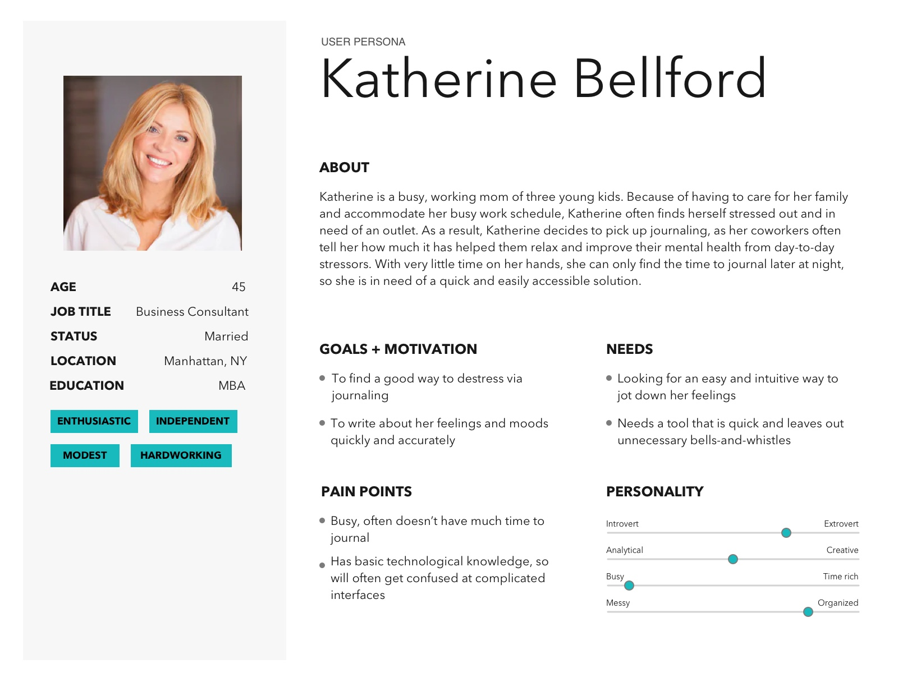
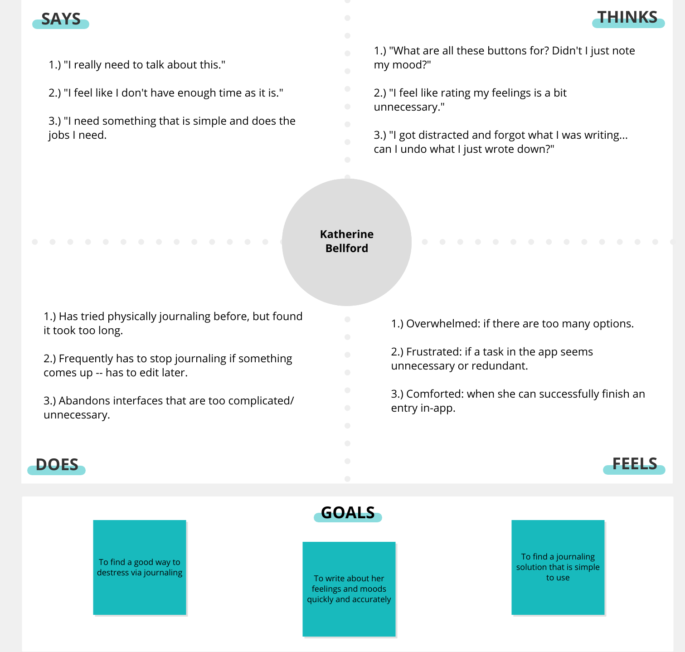
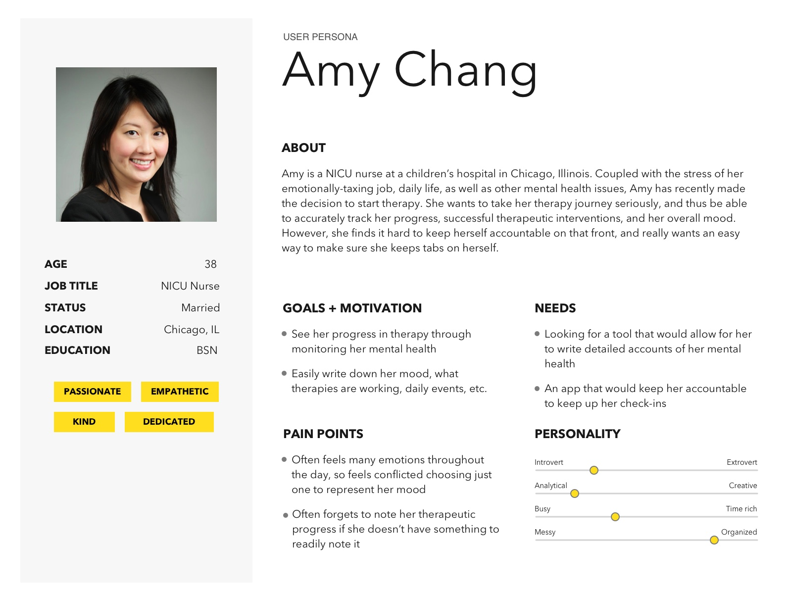
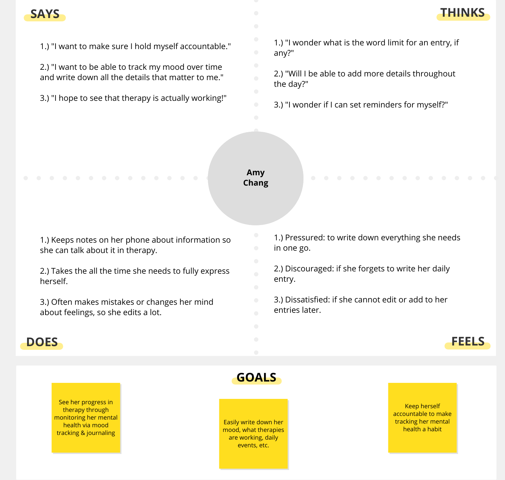
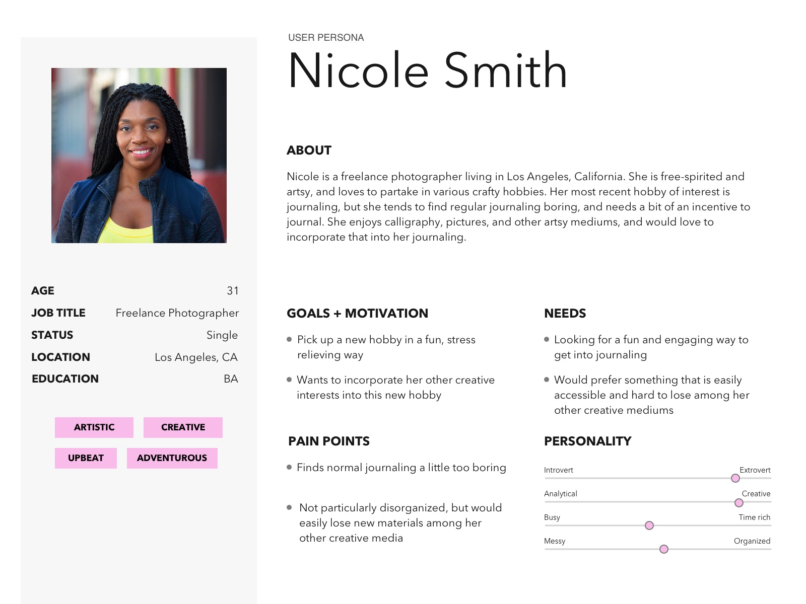
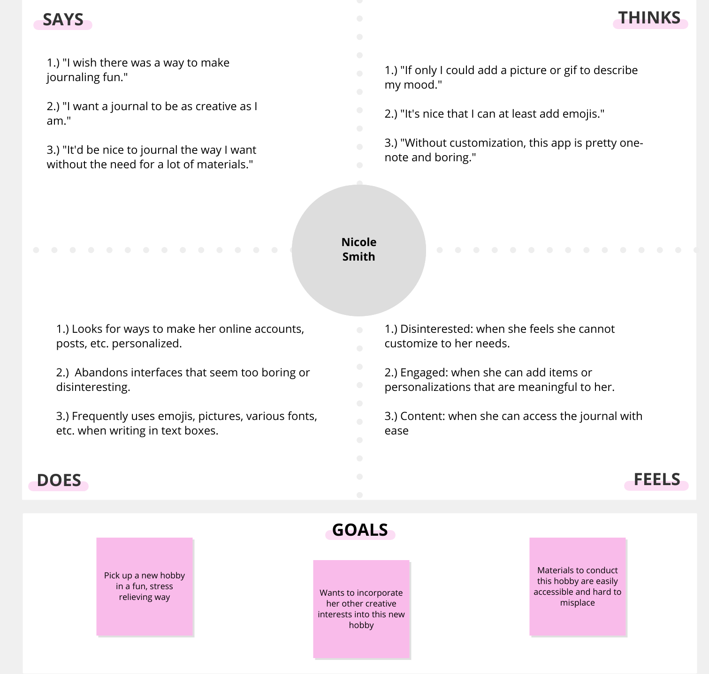
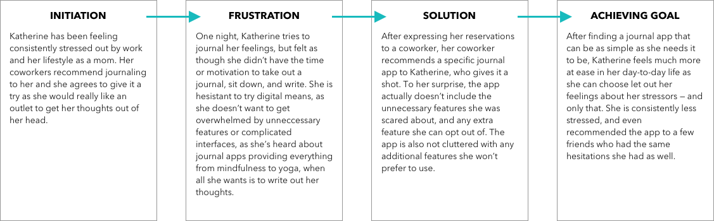
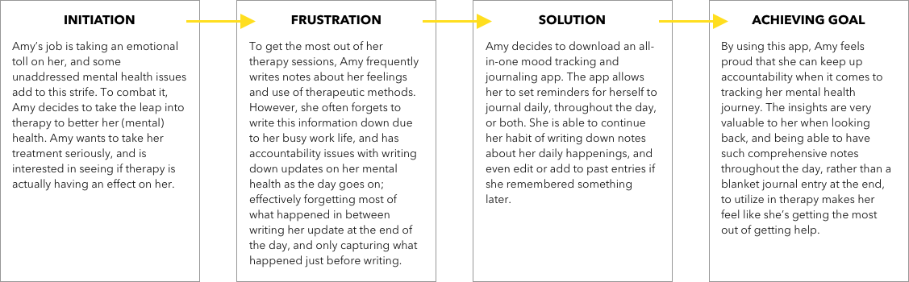
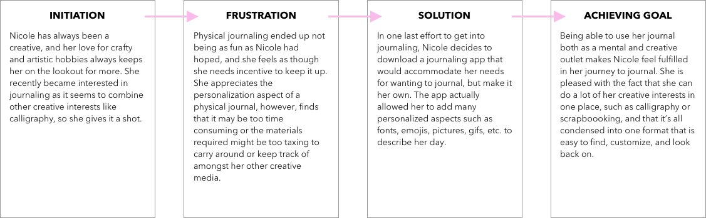

# Assignment 5: Persona + Scenario

## Elena Leon Guerrero - DH150 Fall 2020

## What is the purpose of UX storytelling?

The purpose of UX storytelling is so that designers can get inside the head of their user's and create a product that understands their needs. By generating vivid personas, backstories, use cases, etc., designers are able to find insights in potential user thoughts behavior, contexts, and more in order to create a product fitting for that range of people. Not only that, but UX storytelling allows for a team of designers to be on the same page when it comes to creating a cohesive product, as they share an understanding of who they are creating solutions for and why. 

## Key Design Features:

The key features of this design are as follows:

1) Mood documentation that is tracked in an accurate and user-friendly way. It is quick, concise, and unambiguous when it needs to be, yet detailed and personalized when it doesn't.
2) The ability to document multiple moods throughout the day, through extra entries or added details within a single entry.
3) Optional aesthetic features that serve to make journaling a creative outlet/stress relieving by aiming to make the app more fun, personalized, and engaging.

## Personas + Empathy Maps

### Persona 1: Katherine Bellford

#### Katherine's Empathy Map

### Persona 2: Amy Chang

#### Amy's Empathy Map

### Persona 3: Nicole Smith

#### Nicole's Empathy Map

## Scenarios + Journey Maps

### Katherine's Scenario and Journey Map:

#### Why Katherine is using this product:
*Katherine is a busy mom who also has a full time job -- both contribute to a stressful lifestyle. As a result, she often wishes she had a way to destress at the end of a long day. Her coworkers recommended journaling to her, so Katherine decided to give it a try. Katherine wants to give it a fair shot, but since she has such little time to manually sit down and write, she decided to download an app. She hopes this app is simple, and quick to use to get her thoughts out.*

#### How Katherine is using this product:
*After her kids have gone to bed, Katherine turns on her phone and loads up the app to talk about her day and relieve some stress. The application opens with an option to “Start an Entry” and Katherine selects it. She goes through the process for creating an entry by filling out various fields such as “What is your mood?” and picking an option, until she gets to the point where she can fill in a text box about her day. She writes out her feelings, pushes “Save”, and in a matter of a few minutes, successfully created a quick, concise journal entry.*

#### Katherine's Journey Map:

### Amy's Scenario and Journey Map:

#### Why Amy is using this product:
*Amy works an emotionally tolling job as a NICU nurse, and has been experiencing some mental health issues outside of that. Her health is important to her, so she decided to recently start therapy to address her mental health problems. She intends to take her therapy seriously, and even wants to supplement her treatment with her own data collection so she can track her progress in therapy, list interventions that are working or other notes for her next sessions, and simply how her day was. To do this, Amy uses a journal and mood tracking app that would allow her to see her progress via data insights, write down all the information she wants to throughout the day, and keep her accountable to this new habit.*

#### How Amy is using this product:
*As she goes about her day, Amy tracks her feelings and notes if she successfully used a therapeutic method. To do this, she sets three periodic reminders that occur daily to remind her to write about what’s going on before she forgets the events of the day, her successes in regards to therapy, etc. As she uses the product, Amy can edit past entries with the “edit” if she forgot some information, or adds moods/notes to an entry with an “+” button, which allows her to get an accurate representation of her feelings throughout the day to look back on.*

#### Amy's Journey Map:

### Nicole's Scenario and Journey Map:

#### Why Nicole is using this product:
*As a freelance photographer, Nicole is a natural creative and loves to do crafty and artistic hobbies. Aside from photography, Nicole enjoys mediums like calligraphy, scrapbooking, and more. As for her most recent hobby of interest, Nicole has wanted to get into journaling, but finds regular journaling much too boring, thus needing an incentive to journal. Since she would prefer something that wouldn’t get lost among her other creative supplies, she wanted to try out journaling via an app in hopes that she could even implement some pictures, emojis, and more personalization to her journaling in a streamlined way.*

#### How Nicole is using this product:
*While sitting down for a journaling session, Nicole goes through the motions of getting to where she can write details about her day. Once there, Nicole frequently adds emojis, pictures, gifs, font styles, and more depending on her mood for the day. To do this, she uses the various icons presented at the bottom of the screen when she starts typing, such as a picture icon button for adding pictures or gifs, using her emoji keyboard, or highlighting text then applying the text editing icons (e.g. fonts, size, highlighting, etc.). Once satisfied with the content and aesthetic of this creative outlet, Nicole presses “Save” and happily goes about the rest of her day.*

#### Nicole's Journey Map:

