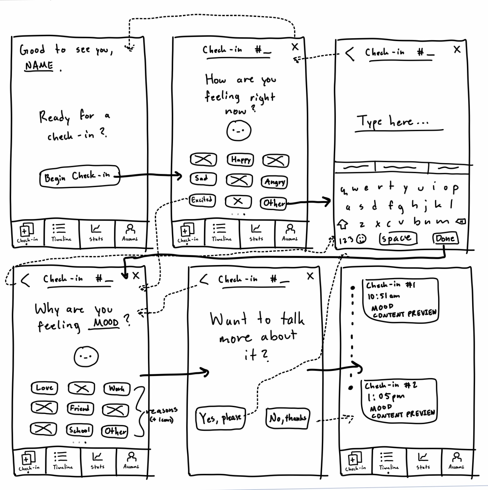
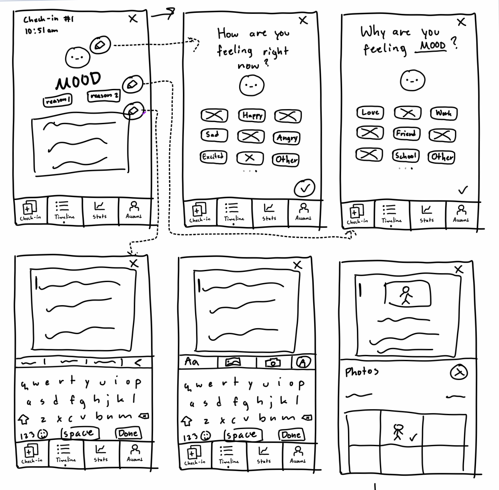
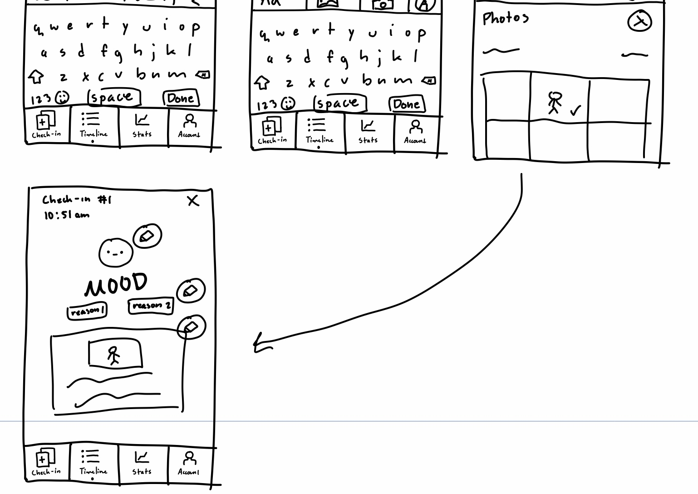
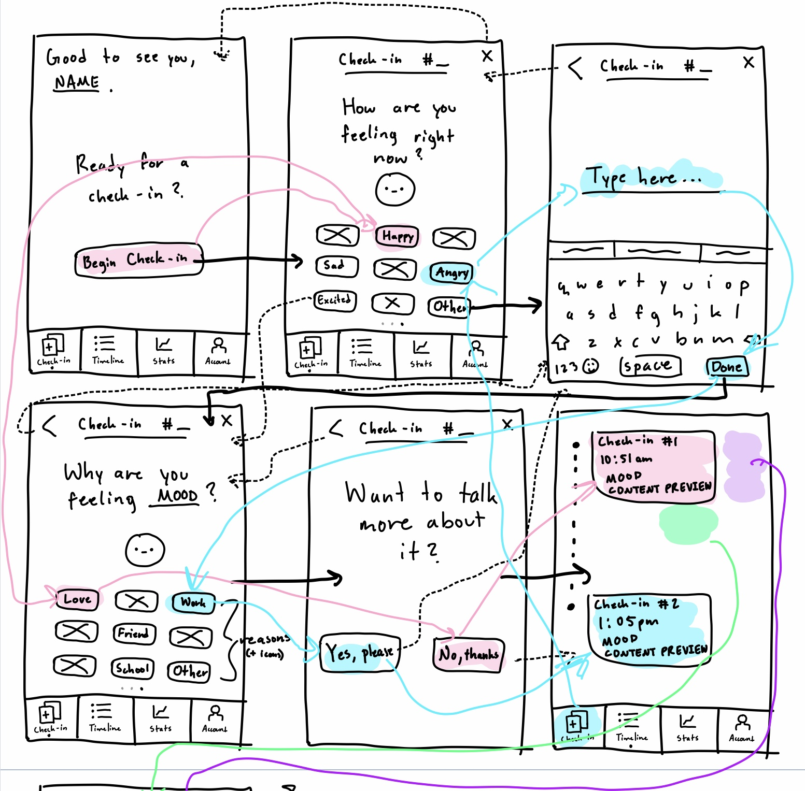
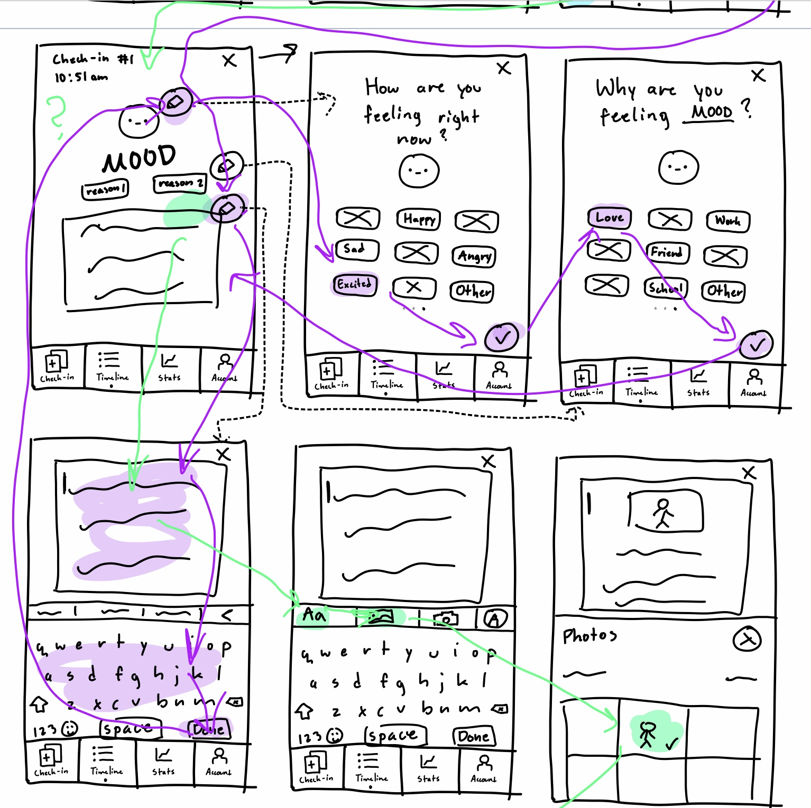
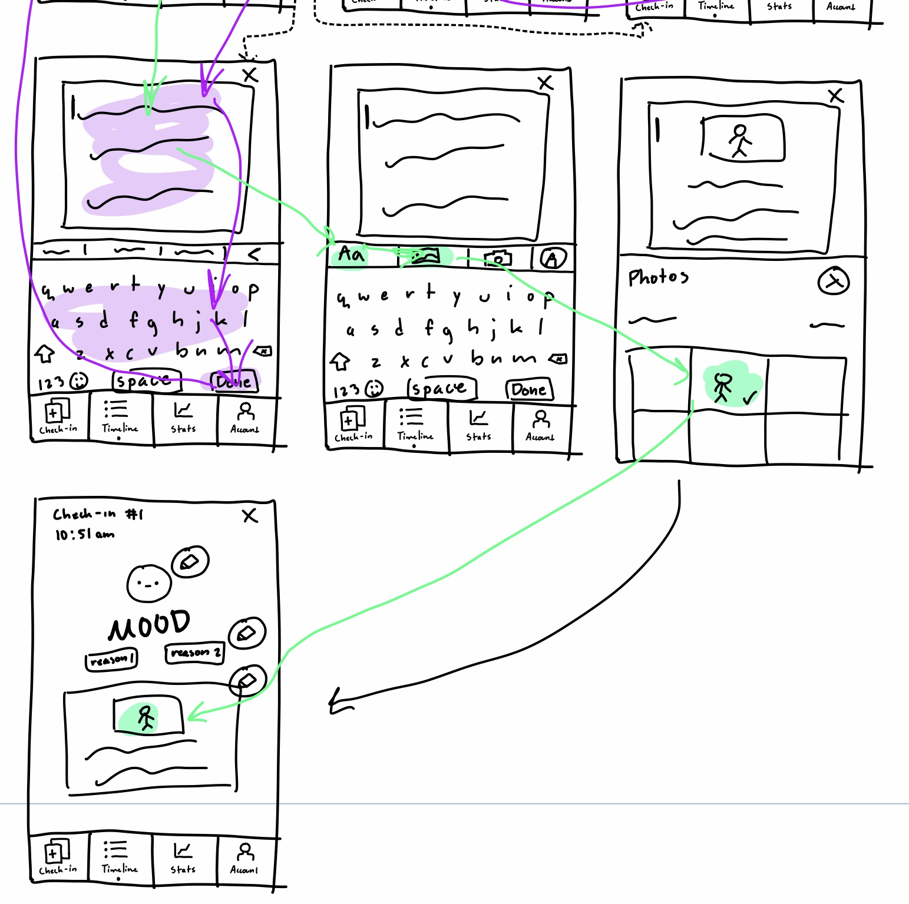

# Assignment 6: Low-Fidelity Prototype

## Elena Leon Guerrero - DH150 Fall 2020

## Project Summary + Prototype Purpose

### Project Summary
The current project aims to aid mental health in the target demographic of middle-aged women by addressing the various issues associated with current self-help mental health resources -- namely, digital journaling. Journaling, and accompanying mood tracking, offer many benefits to one’s mental health, such as acting as an outlet for daily stressors, relieving anxiety, and allowing people to see trends in their mental state. However, many journal apps often come with a range of other features (e.g. meditation practice) that may be unwanted aside from the core intention to journal. Not only that, but many journal apps are not very customizable, and thus perhaps not as fulfilling, especially if journaling is used as a both a mental and creative outlet for the user. As such, this project tries to address these pain points to create a journaling app that doesn’t crowd a user’s experience with unwanted features, yet is still fulfilling and personalized as the user sees fit.

### User Personas
Following heuristic evaluations and user research, I created three user personas inspired by the target demographic of this project. The first was a busy mom who did not have time to journal, nor the time to figure out complex journaling apps with too many features. The second was a woman who recently sought out therapy and wanted to use journaling as a way to supplement her treatment by noting her progress daily, throughout the day. The final persona was a very creative woman who prioritized personalization and meaningful touches to her crafty hobbies, journaling included. As a result of all these personas, I determined that I needed a product that: 1.) is succinct and straightforward in purpose, 2.) is editable and able to be updated as the user needs, and 3.) had options for touches of meaningfulness and creativity to foster emotional and mental fulfillment.

### Purpose
The purpose of this low-fidelity prototype is to examine how intuitive and functional the flow that is suggested by my prototype is. By utilizing it with a test user, I will be able to observe pain points, solutions, and potential overlooked aspects to implement into and improve future iterations of the design.

## Tasks/Features

The list of tasks that my prototype aimed to address were as follows:

* *Task 1: Mood documentation and journal entry creation.*
* *Task 2: Addition of a new entry later in the day.*
* *Task 3: Edit of an entry.*
* *Task 4: Addition of aesthetic and personalization features (e.g. photo sharing) to make journaling more customizable, engaging, and fulfilling.*

## Wireframes + Wireflows

### Prototype (initial state before testing)

*Description: The prototype above depicts the state of the product all the way from opening the app to finalizing the editing of an entry, all while completing the four tasks. The flow is supposed to intend the user to start at the home screen and go through the motions of creating an entry (image 1), double back to the home screen to create a second one for the day (image 2), and then end with editing various portions of an entry (image 3)/adding personalization via pictures (image 3).*

## Prototype Testing

### Task #1, Prototype State #1

*Task regarding mood documentation and creation of a journal entry. The user's actions are depicted in pink for this task.*

### Task #2, Prototype State #2

*Task regarding addition of an existing journal entry throughout the day. The user's actions are depicted in blue for this task.*

### Task #3, Prototype State #3

*Task regarding editing of various features of an existing journal entry. The user's actions are depicted in purple for this task.*

### Task 4, Prototype State #4

*Task regarding addition of journal aesthetic and content personalization features, such as importing of pictures. The user's actions are depicted in green for this task.*

## Key Notes Regarding Prototype Test 

### Task #1

* *Task one seemed to go very smoothly. The user was not confused and completed the task with relative ease.*

### Task #2

* *Except for a minor hiccup where the user didn’t know that clicking the “Check-In” button would take him back to the very first screen, the user completed this task with relative ease as well. Despite not knowing that when creating a new entry, one must always start at the home screen, user seemed to understand the right course of actions to take in order to add an additional entry.*

### Task #3

* *The third task went okay overall. The user knew how to start editing an entry, but got a little confused when it came to the flow for two reasons, namely a missing arrow on my part, and the user overlooking where an arrow went. Other than that, the user successfully edited all three entry details.*

### Task #4

* *The final task was definitely the one my user struggled with the most. Initially, they didn’t know where to start, when I asked them to add a picture to the entry, probably because I didn’t specify the intention that the pictures were supposed to supplement the journal entry paragraphs, rather than the entry as a whole. Because of this, they just guessed what my intentions were, and did successfully add the personalization.*

## Reflection

### Summary
I found this process very interesting! It was somewhat fulfilling to see someone utilize something you drew up and see if it functions or not. I’d say that as a whole, the process went pretty smoothly, and my user could navigate through the wireframes just fine until the final two tasks. This is where it didn’t go as smoothly, and some of it was on my part due to the way I drew up (or forgot to draw up) the prototype. Nevertheless, my user was still able to get all the tasks done, and with some tweaking, I think I could make it so the experience is a little more seamless.

### Potential Revisions
Some of the main things my user got confused about was where the prototype intended to go next, especially if I didn’t have an arrow denoting what screen it would take him to. As a result, if I redid the prototype I would definitely be sure to double check all the connections prior to testing. Another thing I would revise is that I was not specific enough with my instructions for the last task of adding a picture. The user thought that this meant a picture to summarize the entire entry, whereas I thought of it as periodically adding pictures throughout the entry. This actually gave me something to think about however, as perhaps the kind of direct manipulation the user wanted to see could actually work for the purpose of adding pictures the way I envisioned too.
