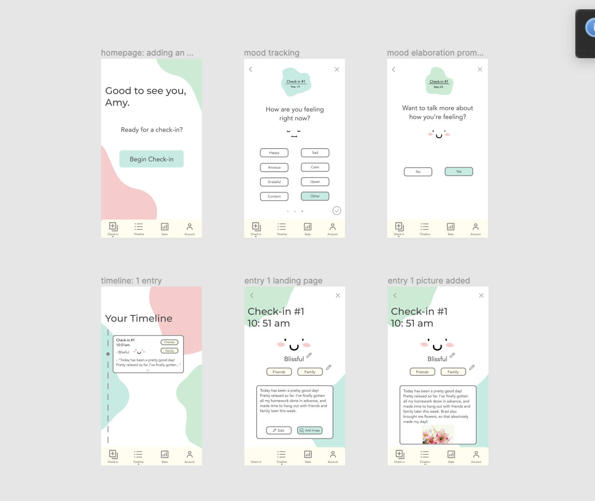
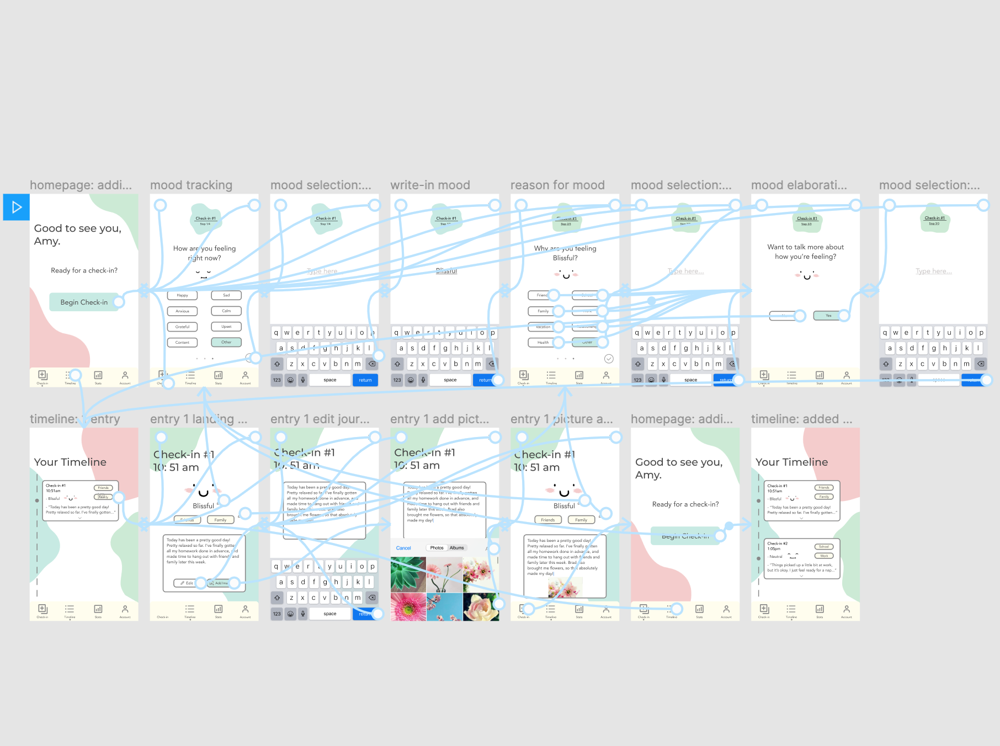
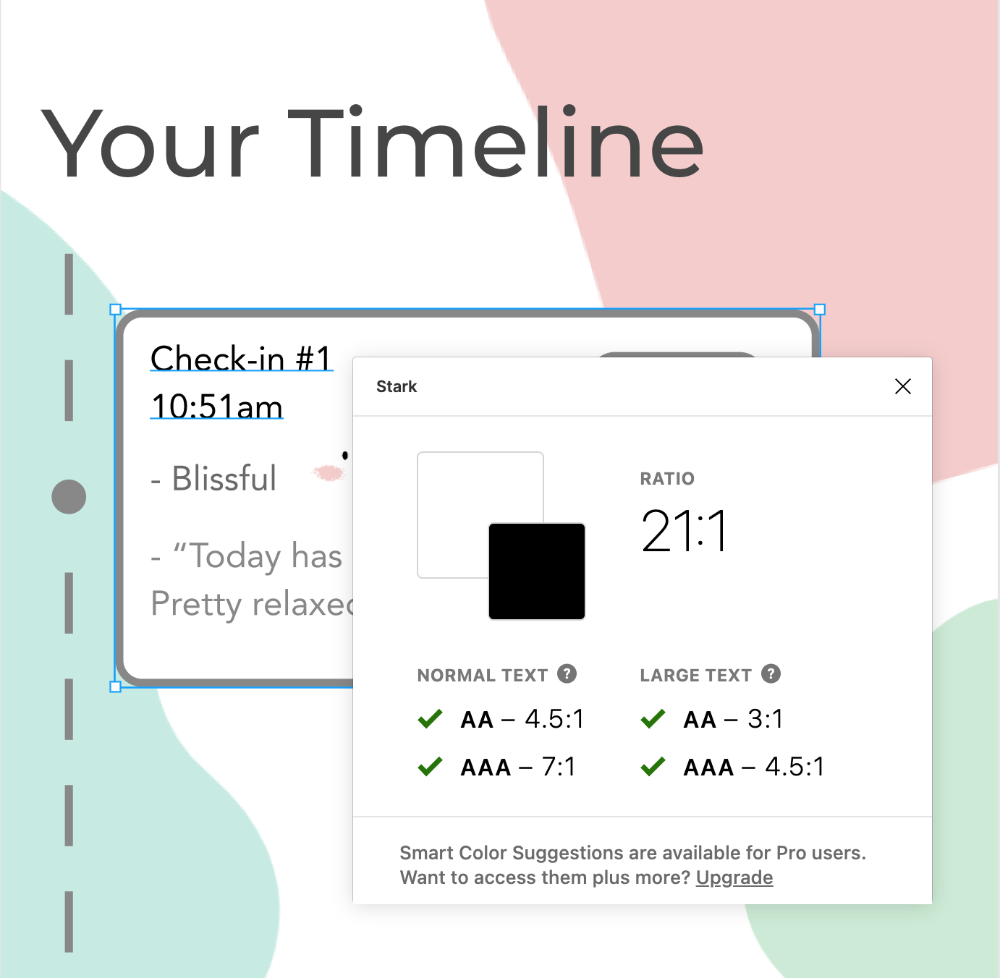
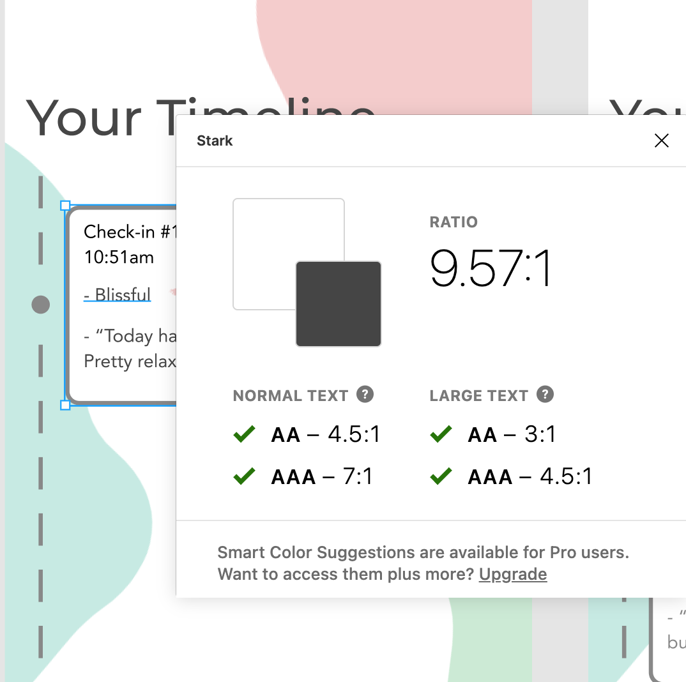
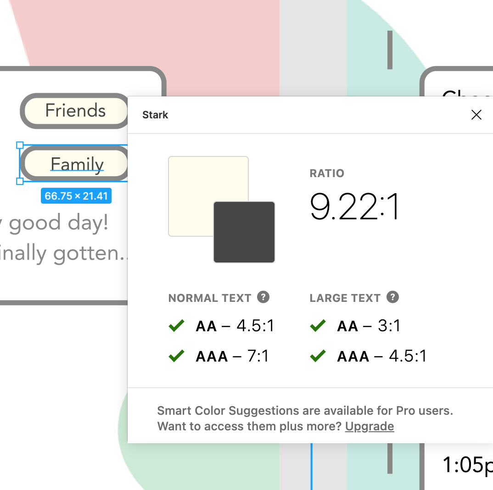
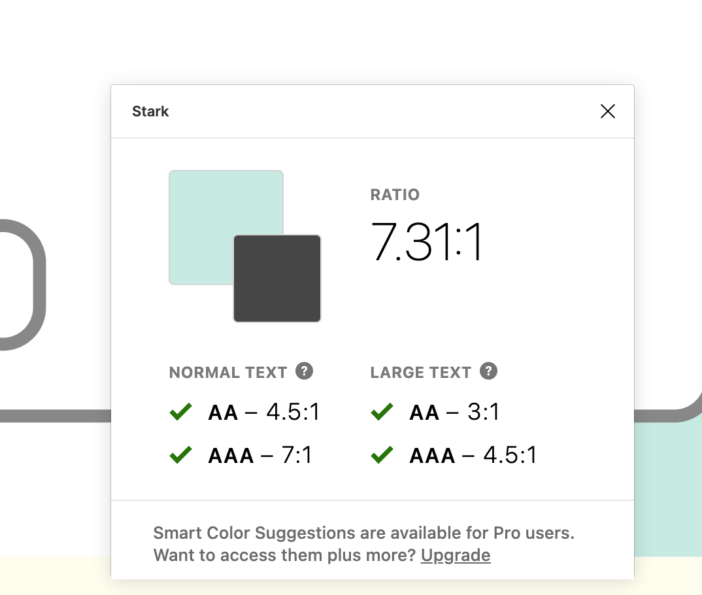

# Assignment 7: High-Fidelity Prototype

## Elena Leon Guerrero - DH150 Fall 2020

## Overview

### Project Description

My project aims to help foster good mental health in the target demographic of middle-aged women through journaling, specifically, addressing the current issues I’ve seen with digital journaling. Journaling is a proven way to bolster one’s mental health, offering benefits such as an outlet for stress, anxiety relief, and tracking one's mental state. In this project, I intend to address problems that make the digital journaling process less streamlined and personalized, such as by doing away with unnecessary features, while adding customization ones.

### Prototype Purpose

The purpose of this high-fidelity prototype is to try to  fully flesh out the UX/UI design of my project in order to properly visualize the functionality, accessibility, and overall aesthetics of the app. By creating this high-fidelity prototype, I will have a way for users to easily test the flow of my project, obtain feedback about the overall design, and make future iterations.

### Prototyping Process 
This high-fidelity prototype was created following several steps of the design process. Following a heuristic evaluation of existing journaling apps, usability testing, and user contextual analysis, I created 3 personas, for whom a product like this is intended for, and their accompanying tasks. After that, I created a hand-drawn low-fidelity prototype that was tested by a user. Taking from each step of the process, and most recently the feedback from my low-fidelity prototype, I implemented these features and changes into designing my high-fidelity prototype created in Figma.

## Tasks

The tasks capable in this prototype are as follows: 

* *Task 1: Mood documentation and journal entry creation.*
* *Task 2: Addition of a new entry later in the day.*
* *Task 3: Edit of an entry.*
* *Task 4: Addition of aesthetic and personalization features (e.g. photo sharing) to make journaling more customizable, engaging, and fulfilling.*

## Wireframes: Representative Screen Designs

## Wireflow

## About the GUI

### Color

When designing this app I knew I wanted it to be a friendly and inviting space without looking too childish, and perhaps a bit journal-inspired. Not only that, but since I intended for the addition of photos in this project, I wanted to make sure the photos would not clash with the color pallette. As a result, I used [this website](https://www.color-hex.com/color-palettes/) to get some inspiration for color palettes that weren't too loud. I found one that had a very white and very light yellow, almost like pages of a journal, and simple pastels from common colors like red, blue, and green, and decided it was the best choice out of all the options I considered to get that clean and inviting look. Additionally, in order to prevent eyestrain from black font over a white background, I decided to use more of a dark gray for most text in the design. See the pictures above for contrast checks of the text colors and their backgrounds.

### Images & Icons

For the images used, I went to [this website](https://icons8.com/illustrations) to find free vector illustrations that could also be edited to match my desired color pallette. I wanted this app to look like many of the more popular interfaces I've seen lately, where there were abstract shapes and pops of color to make it look friendly, yet clean. Aside from the abstract shapes, I also found some understated hand-drawn illustrations of faces to test in my UI, as many journaling apps tend to have some kind of emoji/icon system for their mood trackers.

### Typography
As for typography, I wanted to make sure that the fonts I used were accessible to users, so I chose from some of the most popular sans-serif fonts, "Montserrat" for headings and "Avenir" for text, to keep a clean and easy to read look.

## Key Feedback from Initial Impression Test

Upon showing my high-fidelity prototype to a user, these were the main pieces of feedback they had to say:

* *“I like it, I think the design is clean!*
* *“The colors are nice, but not too in your face, which is something you’d want for something where you’re writing your daily thoughts -- something not overbearing.”*
* *The UI is intuitive, it doesn’t confuse me, and seems pretty straightforward.”*
